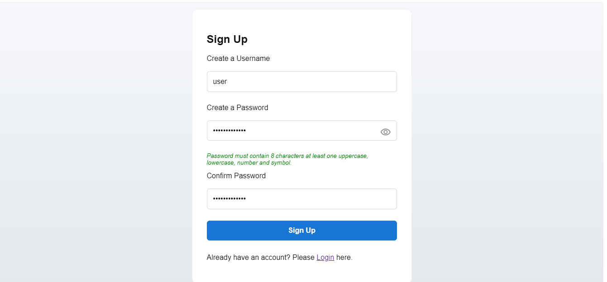
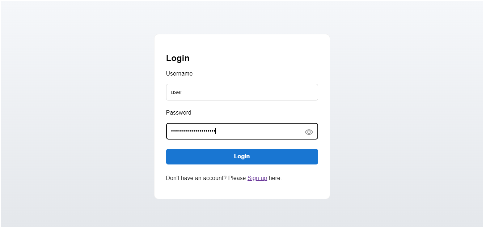
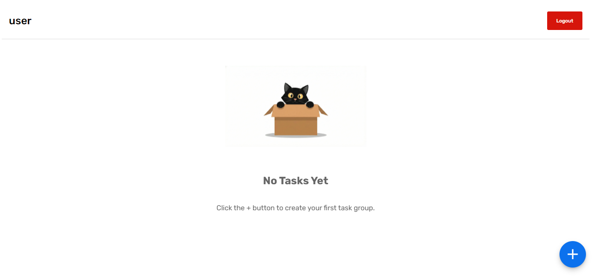
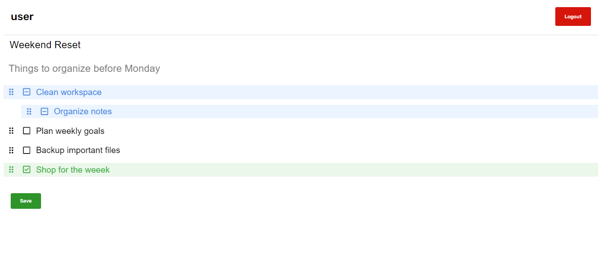
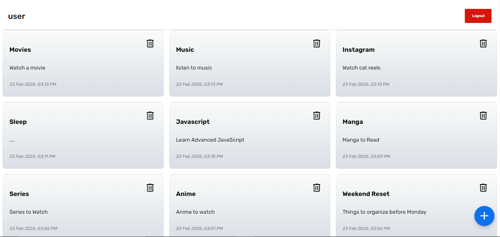

# Task Manager Web App 

A full-stack task management web application built using **Flask and vanilla JavaScript**.
Supports authentication, nested task hierarchy, task state management, and responsive design.

---

## ✨ Features

- Authentication (Argon2 password hashing)
- Session-based authentication
- Nested task hierarchy
- Parent-child structure
- Mobile responsive layout
- State toggle (pending / ongoing / complete)

---

## 🛠 Tech Stack

- Flask
- SQLAlchemy
- SQLite
- Vanilla JavaScript
- CSS Flex/Grid

---

## 📂 Project Structure

```text
task_manager/
│
├── app.py
├── requirements.txt
├── README.md
├── .gitignore
│
├── static/
│   ├── css/
│   ├── js/
│   └── images/
│       └── cat.webp
│
├── templates/
│   ├── login.html
│   ├── sign.html
│   └── task_dashboard.html
│
└── screenshots/
```	

---

## 📸 Screenshots

### Sign up


### Login


### Dashboard


### Tasks


### Task Groups


---

## 🚀 Getting Started

### 1️⃣ Clone the repository

```bash
git clone https://github.com/Vetrivelhp/flask-task-manager.git
cd task_manager
```

## 2️⃣ Install dependencies

```bash
pip install -r requirements.txt
```

## 3️⃣ Run the application

```bash
python app.py
```

Open your browser and go to:
```bash
http://127.0.0.1:5000
```

---

## ⛩ Architecture

- REST-style API endpoints
- Client-generated temporary IDs for mapping parent-child tasks
- Database-enforced foreign keys
- **Dynamic DOM** rendering without page reload

---

## 🔮 Future Improvements

- Drag-and-drop reordering
- Due dates & priority UI
- Category filters
- Deployment to cloud

---

## 📜 License

This project is open-source and available under the MIT License.